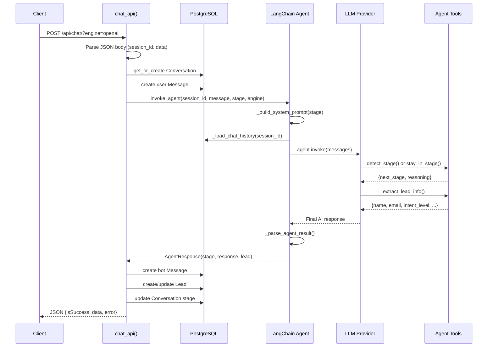
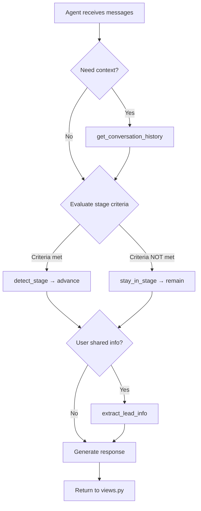

# Backend Documentation

## Table of Contents
1. [Architecture Overview](#1-architecture-overview)
2. [Module Explanations](#2-module-explanations)
3. [Function Reference](#3-function-reference)
4. [API Endpoints](#4-api-endpoints)
5. [Tool Integrations](#5-tool-integrations)
6. [LangChain Backend Integration](#6-langchain-backend-integration)
7. [Database Models](#7-database-models)
8. [Prompt System](#8-prompt-system)
9. [Diagrams](#9-diagrams)

---

## 1. Architecture Overview

The backend is a **Django 6.0 application** structured as a monolithic service with clear separation of concerns:

```
HTTP Request
     │
     ▼
┌─────────────┐     ┌──────────────────┐     ┌─────────────────┐
│  URL Router  │────>│  View (chat_api) │────>│  LangChain Agent│
│  urls.py     │     │  views.py        │     │  langchain_      │
└─────────────┘     └──────────────────┘     │  agent.py        │
                            │                 │                  │
                            │                 │  ┌────────────┐  │
                            │                 │  │ Tools      │  │
                            │                 │  │ - detect   │  │
                            │                 │  │ - extract  │  │
                            │                 │  │ - history  │  │
                            │                 │  └────────────┘  │
                            │                 └─────────────────┘
                            ▼
                    ┌──────────────────┐
                    │  PostgreSQL DB    │
                    │  Lead, Conv, Msg  │
                    └──────────────────┘
```

### Design Principles
- **Single entry point**: One API endpoint (`POST /api/chat/`) handles all chat interactions
- **Agent-first**: All intelligence is delegated to the LangChain ReAct agent
- **Thin view layer**: The view only does I/O — parse, call agent, save, respond
- **Tool-based reasoning**: Stage transitions and lead extraction happen via LLM tool calls, not hardcoded logic

---

## 2. Module Explanations

### `chatbot_backend/chatbot_backend/settings.py`
**Purpose**: Central Django configuration. Defines database connections (PostgreSQL), CORS settings, installed apps, LLM engine configuration (Ollama, OpenAI, LM Studio), logging, and prompt directory paths.

### `chatbot_backend/chatbot_backend/urls.py`
**Purpose**: Root URL router. Maps `/admin/` to Django admin and `/api/` to the chat app URLs.

### `chatbot_backend/chat/urls.py`
**Purpose**: Chat app URL configuration. Maps `/api/chat/` to the `chat_api` view function.

### `chatbot_backend/chat/views.py`
**Purpose**: The single HTTP entry point for the chatbot. Handles request parsing, conversation management, agent invocation, lead persistence, and response formatting.

### `chatbot_backend/chat/models.py`
**Purpose**: Django ORM models defining the database schema — `Lead`, `Conversation`, and `Message` tables.

### `chatbot_backend/chat/services/langchain_agent.py`
**Purpose**: **Core of the system.** Builds and invokes the LangChain ReAct agent. Contains the system prompt template, LLM factory, agent builder, chat history loader, and result parser.

### `chatbot_backend/chat/services/agent_tools.py`
**Purpose**: Defines the four LangChain tools the agent can call: `detect_stage`, `stay_in_stage`, `extract_lead_info`, `get_conversation_history`. Contains the `STAGE_TRANSITION_GUIDE` configuration.

### `chatbot_backend/chat/services/schemas.py`
**Purpose**: Pydantic models for typed data flow: `AgentResponse`, `LeadInfo`, `StageDecision`. Replaces ad-hoc dicts with validated, structured objects.

### `chatbot_backend/chat/utils.py`
**Purpose**: LLM generation utilities for direct (non-agent) LLM calls. Supports Ollama, OpenAI, and LM Studio with chunking, caching, and prompt loading. Used by legacy code paths.

### `chatbot_backend/chat/services/lead_models.py`
**Purpose**: Legacy `LeadData` dataclass with qualification business logic. Kept for backward compatibility.

### `chatbot_backend/chat/services/lead_extraction.py`
**Purpose**: Legacy LLM-based lead extraction using a separate LLM call with JSON parsing. Replaced by the agent's `extract_lead_info` tool.

### `chatbot_backend/chat/services/conversation_orchestrator.py`
**Purpose**: Legacy keyword-based stage transition logic. Replaced by the agent's `detect_stage` tool. Contains `ConversationStage` enum and `determine_next_stage()` function.

### `chatbot_backend/chat/services/ai_service.py`
**Purpose**: Alternative Ollama client using raw HTTP requests instead of the ollama Python SDK.

### `chatbot_backend/chat/services/langgraph_state.py`
**Purpose**: `ConversationState` dataclass for LangGraph state management (session tracking, stage, lead data, control flags).

### `chatbot_backend/utils/message.py`
**Purpose**: Centralized string constants for error messages, success messages, and info messages used across the application.

---

## 3. Function Reference

### `chat/views.py`

#### `chat_api(request)`
| Field | Detail |
|-------|--------|
| **File** | `chat/views.py:50` |
| **Purpose** | Main API endpoint. Receives user messages, invokes the LangChain agent, saves results to DB, returns JSON response |
| **Parameters** | `request` (Django HttpRequest) — expects POST with JSON body `{session_id, data}` and query param `?engine=` |
| **Returns** | `JsonResponse` with `{isSuccess, data: {engine, stage, duration, response, lead}, error}` |
| **Called by** | Django URL router (`/api/chat/`) |
| **Calls** | `Conversation.objects.get_or_create()`, `Message.objects.create()`, `invoke_agent()`, `Lead.objects.get_or_create()` |

---

### `chat/services/langchain_agent.py`

#### `invoke_agent(session_id, user_message, current_stage, engine)`
| Field | Detail |
|-------|--------|
| **File** | `langchain_agent.py:325` |
| **Purpose** | Main entry point for AI processing. Invokes the LangChain ReAct agent with full conversation context |
| **Parameters** | `session_id: str`, `user_message: str`, `current_stage: str`, `engine: str` (default "openai") |
| **Returns** | `AgentResponse` (stage, response text, lead info) |
| **Called by** | `chat_api()` in views.py |
| **Calls** | `get_or_build_agent()`, `_build_system_prompt()`, `_load_chat_history()`, `agent.invoke()`, `_parse_agent_result()` |

#### `build_agent(engine, checkpointer)`
| Field | Detail |
|-------|--------|
| **File** | `langchain_agent.py:253` |
| **Purpose** | Constructs the LangGraph ReAct agent with LLM, tools, and checkpointer |
| **Parameters** | `engine: str`, `checkpointer` (optional, defaults to MemorySaver) |
| **Returns** | Tuple of `(agent, checkpointer)` |
| **Called by** | `get_or_build_agent()` |
| **Calls** | `get_llm()`, `create_react_agent()`, `MemorySaver()` |

#### `get_llm(engine)`
| Field | Detail |
|-------|--------|
| **File** | `langchain_agent.py:182` |
| **Purpose** | Factory function creating the appropriate LangChain LLM wrapper |
| **Parameters** | `engine: str` — "openai", "ollama", or "lmstudio" |
| **Returns** | `ChatOpenAI` or `ChatOllama` instance |
| **Called by** | `build_agent()` |
| **Calls** | `ChatOpenAI()`, `ChatOllama()` |

#### `get_or_build_agent(engine)`
| Field | Detail |
|-------|--------|
| **File** | `langchain_agent.py:314` |
| **Purpose** | Singleton cache for agents. Returns cached agent or builds new one |
| **Parameters** | `engine: str` |
| **Returns** | Tuple of `(agent, checkpointer)` |
| **Called by** | `invoke_agent()` |
| **Calls** | `build_agent()` |

#### `_build_system_prompt(stage, session_id)`
| Field | Detail |
|-------|--------|
| **File** | `langchain_agent.py:155` |
| **Purpose** | Assembles the full system prompt from template + stage-specific instructions |
| **Parameters** | `stage: str`, `session_id: str` |
| **Returns** | `str` — formatted system prompt |
| **Called by** | `invoke_agent()` |
| **Calls** | `_load_stage_prompt()`, `STAGE_TRANSITION_GUIDE.get()` |

#### `_load_stage_prompt(stage)`
| Field | Detail |
|-------|--------|
| **File** | `langchain_agent.py:135` |
| **Purpose** | Loads stage-specific prompt text from `utils/Prompts/Lead/<stage>.txt` |
| **Parameters** | `stage: str` |
| **Returns** | `str` — prompt template content |
| **Called by** | `_build_system_prompt()` |

#### `_load_chat_history(session_id)`
| Field | Detail |
|-------|--------|
| **File** | `langchain_agent.py:386` |
| **Purpose** | Loads conversation messages from DB as LangChain message objects. Excludes last user message (passed separately) |
| **Parameters** | `session_id: str` |
| **Returns** | `list[HumanMessage | AIMessage]` |
| **Called by** | `invoke_agent()` |
| **Calls** | `Conversation.objects.get()`, `Message.objects.filter()` |

#### `_parse_agent_result(result, fallback_stage)`
| Field | Detail |
|-------|--------|
| **File** | `langchain_agent.py:428` |
| **Purpose** | Parses the LangGraph agent output into structured `AgentResponse`. Extracts final response, stage decision, and lead info from tool messages |
| **Parameters** | `result: dict`, `fallback_stage: str` |
| **Returns** | `AgentResponse` |
| **Called by** | `invoke_agent()` |

---

### `chat/services/agent_tools.py`

#### `detect_stage(current_stage, user_message, conversation_summary)`
| Field | Detail |
|-------|--------|
| **File** | `agent_tools.py:67` |
| **Purpose** | LangChain tool — decides whether to advance the conversation to the next funnel stage |
| **Parameters** | `current_stage: str`, `user_message: str`, `conversation_summary: str` |
| **Returns** | `dict` with `{current_stage, next_stage, reasoning}` |
| **Called by** | LangChain agent (tool call) |

#### `stay_in_stage(current_stage, reason)`
| Field | Detail |
|-------|--------|
| **File** | `agent_tools.py:118` |
| **Purpose** | LangChain tool — keeps the conversation in the current stage |
| **Parameters** | `current_stage: str`, `reason: str` |
| **Returns** | `dict` with `{current_stage, next_stage (same), reasoning}` |
| **Called by** | LangChain agent (tool call) |

#### `extract_lead_info(name, email, phone, company, problem, intent_level)`
| Field | Detail |
|-------|--------|
| **File** | `agent_tools.py:137` |
| **Purpose** | LangChain tool — extracts and records lead information from the visitor |
| **Parameters** | All optional: `name`, `email`, `phone`, `company`, `problem`, `intent_level` (default "low") |
| **Returns** | `dict` with all lead fields |
| **Called by** | LangChain agent (tool call) |

#### `get_conversation_history(session_id)`
| Field | Detail |
|-------|--------|
| **File** | `agent_tools.py:179` |
| **Purpose** | LangChain tool — retrieves full conversation history from the database |
| **Parameters** | `session_id: str` |
| **Returns** | `str` — formatted conversation transcript |
| **Called by** | LangChain agent (tool call) |

---

### `chat/services/schemas.py`

#### `LeadInfo` (Pydantic BaseModel)
| Field | Detail |
|-------|--------|
| **File** | `schemas.py:35` |
| **Purpose** | Structured lead data with validation and qualification logic |
| **Fields** | `name`, `email`, `phone`, `company`, `problem`, `intent_level` |
| **Methods** | `is_qualified()` → `True` when `intent_level == "high"` AND `email` or `phone` provided |
| **Used by** | `_parse_agent_result()`, `chat_api()` |

#### `AgentResponse` (Pydantic BaseModel)
| Field | Detail |
|-------|--------|
| **File** | `schemas.py:64` |
| **Purpose** | Bundles agent output: chatbot response, stage, and lead info |
| **Fields** | `stage: str`, `response: str`, `lead: LeadInfo` |
| **Used by** | `invoke_agent()` return type, consumed by `chat_api()` |

#### `StageDecision` (Pydantic BaseModel)
| Field | Detail |
|-------|--------|
| **File** | `schemas.py:18` |
| **Purpose** | Represents stage transition decision |
| **Fields** | `current_stage`, `next_stage`, `reasoning` |

---

### `chat/utils.py`

#### `generate_llm_response(data, prompt, engine, stakeholder_name, file_name)`
| Field | Detail |
|-------|--------|
| **File** | `utils.py:131` |
| **Purpose** | Main entrypoint for direct LLM generation (non-agent path). Loads prompts, dispatches to engine, caches results |
| **Parameters** | `data: str`, `prompt: str`, `engine: str`, `stakeholder_name`, `file_name` |
| **Returns** | `dict` with `{engine, duration, summary}` |
| **Called by** | `extract_lead_from_message()` (legacy) |
| **Calls** | `load_prompt()`, `generate_with_ollama()`, `generate_with_openai()`, `generate_with_lmstudio()` |

#### `load_prompt(prompt, stakeholder_name, file_name)`
| Field | Detail |
|-------|--------|
| **File** | `utils.py:93` |
| **Purpose** | Loads prompt template from disk with stakeholder-specific fallback chain |
| **Parameters** | `prompt: str` (category), `stakeholder_name: str`, `file_name: str` |
| **Returns** | `str` — prompt content |

#### `generate_with_ollama(data, prompt)`
| Field | Detail |
|-------|--------|
| **File** | `utils.py:196` |
| **Purpose** | Generates response using Ollama with chunking for large inputs |
| **Returns** | `tuple[str, float]` — (response text, duration) |

#### `generate_with_openai(user_input, system_prompt, model, temperature)`
| Field | Detail |
|-------|--------|
| **File** | `utils.py:291` |
| **Purpose** | Generates response using OpenAI API |
| **Returns** | `tuple[str, float]` — (response text, duration) |

#### `generate_with_lmstudio(data, prompt, model)`
| Field | Detail |
|-------|--------|
| **File** | `utils.py:262` |
| **Purpose** | Generates response using LM Studio's OpenAI-compatible API |
| **Returns** | `tuple[str, float]` — (response text, duration) |

#### `count_tokens(text)`
| Field | Detail |
|-------|--------|
| **File** | `utils.py:32` |
| **Purpose** | Estimates token count (1 token ≈ 4 characters) |

#### `chunk_text(text, size)`
| Field | Detail |
|-------|--------|
| **File** | `utils.py:37` |
| **Purpose** | Splits text into chunks without breaking mid-line |

---

### Legacy Modules (Replaced by LangChain Agent)

#### `conversation_orchestrator.py`

| Function | Purpose | Status |
|----------|---------|--------|
| `determine_next_stage(current_stage, user_message)` | Keyword-based stage transitions | **Replaced** by `detect_stage` tool |
| `get_prompt_for_stage(stage)` | Returns prompt category tuple | **Replaced** by `_load_stage_prompt()` |
| `orchestrate_conversation(user_message, current_stage)` | Entry point for old orchestration | **Replaced** by `invoke_agent()` |

#### `lead_extraction.py`

| Function | Purpose | Status |
|----------|---------|--------|
| `extract_lead_from_message(user_message, engine, stage)` | LLM-based lead extraction with JSON parsing | **Replaced** by `extract_lead_info` tool |
| `_safe_json_extract(text)` | Parses JSON from LLM output | **Replaced** by Pydantic schemas |
| `_infer_intent_from_stage(stage, extracted_intent)` | Stage-to-intent mapping | **Integrated** into tool docstring |

---

## 4. API Endpoints

### `POST /api/chat/`

**Query Parameters:**
| Parameter | Type | Default | Description |
|-----------|------|---------|-------------|
| `engine` | string | `"ollama"` | LLM engine: `"openai"`, `"ollama"`, or `"lmstudio"` |

**Request Body:**
```json
{
  "session_id": "abc-123",
  "data": "Hello, I need help with solar panels"
}
```

**Success Response (200):**
```json
{
  "isSuccess": true,
  "data": {
    "engine": "openai",
    "stage": "discovery",
    "duration": 2.45,
    "response": "Thanks for reaching out! What kind of help are you looking for?",
    "lead": {
      "qualified": false,
      "intent_level": "low",
      "email": null,
      "phone": null
    }
  },
  "error": null
}
```

**Error Responses:**

| Status | Condition | Example Error |
|--------|-----------|---------------|
| 400 | Missing session_id | `"session_id is required"` |
| 400 | Missing message | `"Message is required"` |
| 400 | Invalid JSON body | `"Invalid JSON in request body"` |
| 400 | ValueError | `"Unsupported engine: 'xyz'"` |
| 500 | Unexpected error | `"Internal LLM error"` |

---

## 5. Tool Integrations

### Sales Funnel Stage Flow

```
greeting → discovery → qualification → contact → closing
```

### Stage Transition Guide (STAGE_TRANSITION_GUIDE)

| Stage | Description | Advance When | Next |
|-------|-------------|-------------|------|
| **greeting** | Visitor just arrived. Welcome them. | Visitor responded and indicated why they're here | discovery |
| **discovery** | Understanding the visitor's problem | Visitor clearly described problem/need with enough detail | qualification |
| **qualification** | Assessing if visitor is a potential customer | Visitor asking about pricing, timelines, or next steps | contact |
| **contact** | Collecting contact information | Visitor provided email or phone number | closing |
| **closing** | Wrapping up the conversation | N/A — final stage | closing |

### Intent Level Mapping

| Stage | Intent Level | Rationale |
|-------|-------------|-----------|
| greeting | low | Just browsing |
| discovery | low | Exploring needs |
| qualification | medium | Shows interest |
| contact | high | Providing contact info |
| closing | high | Ready to proceed |

### Lead Qualification Rule
```
qualified = (intent_level == "high") AND (email OR phone provided)
```

---

## 6. LangChain Backend Integration

### Components Used

| LangChain Component | Import | Purpose |
|---------------------|--------|---------|
| `ChatOpenAI` | `langchain_openai` | OpenAI LLM wrapper with tool calling |
| `ChatOllama` | `langchain_ollama` | Ollama LLM wrapper with tool calling |
| `create_react_agent` | `langgraph.prebuilt` | Creates ReAct (Reason+Act) agent |
| `MemorySaver` | `langgraph.checkpoint.memory` | In-memory conversation state persistence |
| `HumanMessage` | `langchain_core.messages` | User message wrapper |
| `AIMessage` | `langchain_core.messages` | Assistant message wrapper |
| `SystemMessage` | `langchain_core.messages` | System prompt wrapper |
| `ToolMessage` | `langchain_core.messages` | Tool result wrapper |
| `@tool` decorator | `langchain_core.tools` | Converts functions to LangChain tools |

### Agent Configuration
- **Agent Type**: ReAct (Reasoning + Acting)
- **Temperature**: 0.3 (low creativity for consistent business responses)
- **Checkpointer**: MemorySaver (in-memory, per server process)
- **Thread ID**: session_id (links requests to conversation state)
- **Tools**: 4 custom tools (detect_stage, stay_in_stage, extract_lead_info, get_conversation_history)

### System Prompt Architecture
The system prompt is dynamically constructed per request:
1. **Base template** (SYSTEM_PROMPT_TEMPLATE) — role, rules, tool instructions
2. **Stage description** — from STAGE_TRANSITION_GUIDE
3. **Stage prompt** — from `utils/Prompts/Lead/<stage>.txt` files
4. **Session context** — session_id for tool calls

---

## 7. Database Models

### Lead Model

| Field | Type | Constraints | Description |
|-------|------|-------------|-------------|
| `id` | AutoField | PK | Primary key |
| `name` | CharField(255) | nullable | Visitor's name |
| `email` | EmailField | nullable | Visitor's email |
| `phone` | CharField(50) | nullable | Visitor's phone |
| `company` | CharField(255) | nullable | Company name |
| `problem` | TextField | nullable | Business problem described |
| `intent_level` | CharField(10) | choices: low/medium/high | Purchase intent |
| `qualified` | BooleanField | default: False | Lead qualification status |
| `source` | CharField(100) | default: "website" | Lead source channel |
| `created_at` | DateTimeField | auto_now_add | Creation timestamp |

### Conversation Model

| Field | Type | Constraints | Description |
|-------|------|-------------|-------------|
| `id` | AutoField | PK | Primary key |
| `lead` | ForeignKey(Lead) | nullable, CASCADE | Associated lead |
| `session_id` | CharField(255) | unique | Frontend session identifier |
| `stage` | CharField(20) | choices: greeting/discovery/qualification/contact/closing | Current funnel stage |
| `channel` | CharField(50) | default: "website" | Communication channel |
| `started_at` | DateTimeField | auto_now_add | Session start |
| `updated_at` | DateTimeField | auto_now | Last update |

### Message Model

| Field | Type | Constraints | Description |
|-------|------|-------------|-------------|
| `id` | AutoField | PK | Primary key |
| `conversation` | ForeignKey(Conversation) | CASCADE | Parent conversation |
| `role` | CharField(10) | choices: user/bot | Message sender |
| `content` | TextField | required | Message text |
| `created_at` | DateTimeField | auto_now_add | Send time |

---

## 8. Prompt System

### Prompt Directory Structure
```
utils/Prompts/
├── Lead/           # Stage-specific prompts (loaded by agent)
│   ├── greeting.txt
│   ├── discovery.txt
│   ├── qualification.txt
│   ├── contact.txt
│   └── closing.txt
├── Chat/           # Generic chat prompts (legacy)
│   └── generic.txt
└── Extract/        # Data extraction prompts (legacy)
    └── lead_extract.txt
```

### Prompt Loading Strategy
1. **Agent path** (current): `_load_stage_prompt(stage)` reads `Lead/<stage>.txt` and injects it into `SYSTEM_PROMPT_TEMPLATE`
2. **Legacy path**: `load_prompt(prompt, stakeholder, file_name)` with stakeholder-specific → file fallback → dynamic generation

---

## 9. Diagrams

### Backend Request Flow



### Agent Tool Flow



### Function Call Graph

```
User HTTP Request
    │
    ▼
chat_api(request)                          [views.py:50]
    ├── json.loads(request.body)
    ├── Conversation.objects.get_or_create()
    ├── Message.objects.create()            (save user msg)
    │
    ├── invoke_agent()                      [langchain_agent.py:325]
    │   ├── get_or_build_agent()           [langchain_agent.py:314]
    │   │   └── build_agent()              [langchain_agent.py:253]
    │   │       ├── get_llm()              [langchain_agent.py:182]
    │   │       │   ├── ChatOpenAI()       (if engine=openai)
    │   │       │   ├── ChatOllama()       (if engine=ollama)
    │   │       │   └── ChatOpenAI()       (if engine=lmstudio, custom base_url)
    │   │       └── create_react_agent()   (LangGraph)
    │   │
    │   ├── _build_system_prompt()         [langchain_agent.py:155]
    │   │   ├── STAGE_TRANSITION_GUIDE     [agent_tools.py:38]
    │   │   └── _load_stage_prompt()       [langchain_agent.py:135]
    │   │       └── open(Prompts/Lead/<stage>.txt)
    │   │
    │   ├── _load_chat_history()           [langchain_agent.py:386]
    │   │   └── Message.objects.filter()
    │   │
    │   ├── agent.invoke(messages, config) (LangGraph execution)
    │   │   ├── detect_stage()             [agent_tools.py:67]   (or)
    │   │   ├── stay_in_stage()            [agent_tools.py:118]
    │   │   ├── extract_lead_info()        [agent_tools.py:137]
    │   │   └── get_conversation_history() [agent_tools.py:179]
    │   │
    │   └── _parse_agent_result()          [langchain_agent.py:428]
    │       └── returns AgentResponse
    │
    ├── Message.objects.create()            (save bot msg)
    ├── Lead.objects.get_or_create()        (save lead)
    ├── conversation.save()                 (update stage)
    │
    └── return JsonResponse()
```
