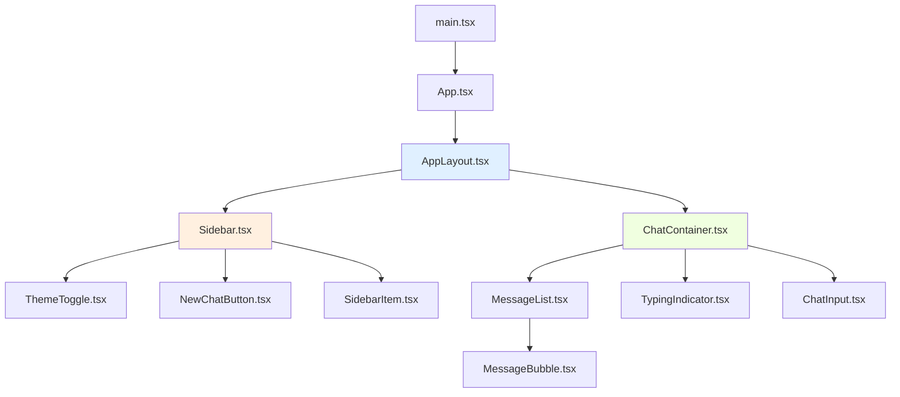
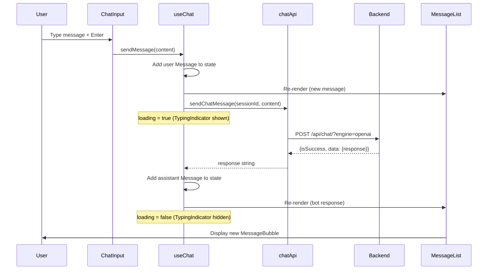
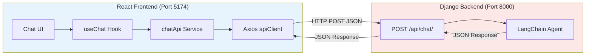

# Frontend Documentation

## Table of Contents
1. [Architecture Overview](#1-architecture-overview)
2. [Tech Stack](#2-tech-stack)
3. [Component Reference](#3-component-reference)
4. [State Management](#4-state-management)
5. [API Communication](#5-api-communication)
6. [Type Definitions](#6-type-definitions)
7. [Chat UI Logic](#7-chat-ui-logic)
8. [Configuration](#8-configuration)
9. [Diagrams](#9-diagrams)

---

## 1. Architecture Overview

The frontend is a **React 19 single-page application** built with TypeScript, Vite, and Tailwind CSS. It provides a ChatGPT-style interface with a sidebar, chat area, and input field.

```
┌─────────────────────────────────────────────────────────┐
│                    AppLayout                             │
│  ┌──────────┐  ┌────────────────────────────────────┐  │
│  │ Sidebar   │  │         ChatContainer              │  │
│  │           │  │                                    │  │
│  │ Theme     │  │  ┌──────────────────────────────┐  │  │
│  │ Toggle    │  │  │       MessageList            │  │  │
│  │           │  │  │                              │  │  │
│  │ New Chat  │  │  │  ┌────────────────────────┐  │  │  │
│  │ Button    │  │  │  │ MessageBubble (user)   │  │  │  │
│  │           │  │  │  ├────────────────────────┤  │  │  │
│  │ Session   │  │  │  │ MessageBubble (bot)    │  │  │  │
│  │ List      │  │  │  ├────────────────────────┤  │  │  │
│  │           │  │  │  │ TypingIndicator        │  │  │  │
│  │           │  │  │  └────────────────────────┘  │  │  │
│  │           │  │  └──────────────────────────────┘  │  │
│  │           │  │                                    │  │
│  │           │  │  ┌──────────────────────────────┐  │  │
│  │           │  │  │        ChatInput             │  │  │
│  │           │  │  │  [Message input...]  [Send]  │  │  │
│  │           │  │  └──────────────────────────────┘  │  │
│  └──────────┘  └────────────────────────────────────┘  │
└─────────────────────────────────────────────────────────┘
```

### Design Principles
- **Component composition**: Small, focused components composed together
- **Custom hooks**: Business logic lives in hooks, not components
- **TypeScript-first**: All data types are explicitly defined
- **Responsive**: Mobile-first with sidebar overlay on small screens
- **Dark mode**: Full dark/light theme support via Tailwind `dark:` classes

---

## 2. Tech Stack

| Technology | Version | Purpose |
|-----------|---------|---------|
| **React** | 19.2.0 | UI library |
| **TypeScript** | 5.9.3 | Type safety |
| **Vite** | 7.2.4 | Build tool + HMR dev server |
| **Tailwind CSS** | 3.4.19 | Utility-first CSS framework |
| **Axios** | 1.13.5 | HTTP client for API calls |
| **React Router DOM** | 7.13.0 | Client-side routing (installed but not actively used) |

### Build Scripts

| Script | Command | Purpose |
|--------|---------|---------|
| `dev` | `vite` | Start dev server (port 5174) |
| `build` | `tsc -b && vite build` | Type-check and build for production |
| `lint` | `eslint .` | Run ESLint checks |
| `preview` | `vite preview` | Preview production build locally |

---

## 3. Component Reference

### `App.tsx`
| Field | Detail |
|-------|--------|
| **File** | `src/App.tsx` |
| **Purpose** | Root component — renders AppLayout |
| **Children** | `<AppLayout />` |
| **State** | None |

### `AppLayout.tsx`
| Field | Detail |
|-------|--------|
| **File** | `src/layouts/AppLayout.tsx` |
| **Purpose** | Main layout orchestrator. Wires hooks to components, manages sidebar state |
| **Children** | `<Sidebar />`, `<ChatContainer />` |
| **Hooks Used** | `useTheme()`, `useChatSession()`, `useChat(sessionId)` |
| **Local State** | `sidebarOpen: boolean`, `activeSessionId: string` |
| **Key Logic** | `handleNewChat()` — resets session, clears messages |

### `ChatContainer.tsx`
| Field | Detail |
|-------|--------|
| **File** | `src/components/chat/ChatContainer.tsx` |
| **Purpose** | Scrollable chat area with auto-scroll on new messages |
| **Props** | `messages: Message[]`, `loading: boolean`, `onSendMessage: (msg) => void` |
| **Children** | `<MessageList />`, `<TypingIndicator />` (conditional), `<ChatInput />` |
| **Effects** | Auto-scrolls to bottom when messages change or loading state changes |

### `ChatInput.tsx`
| Field | Detail |
|-------|--------|
| **File** | `src/components/chat/ChatInput.tsx` |
| **Purpose** | Text input with send button. Supports Enter to send, Shift+Enter for newline |
| **Props** | `onSend: (message) => void`, `disabled?: boolean` |
| **Local State** | `value: string` |
| **Key Logic** | Trims whitespace, prevents empty sends, auto-focuses after send |
| **UI** | Rounded textarea + circular blue send button with SVG arrow icon |

### `MessageBubble.tsx`
| Field | Detail |
|-------|--------|
| **File** | `src/components/chat/MessageBubble.tsx` |
| **Purpose** | Renders a single message with role-based styling |
| **Props** | `message: Message` |
| **Styling** | User messages: blue background, right-aligned. Bot messages: gray background, left-aligned |

### `MessageList.tsx`
| Field | Detail |
|-------|--------|
| **File** | `src/components/chat/MessageList.tsx` |
| **Purpose** | Renders list of messages or empty state placeholder |
| **Props** | `messages: Message[]` |
| **Empty State** | "How can I help you today?" heading with subtitle |
| **Children** | Maps messages to `<MessageBubble />` components |

### `TypingIndicator.tsx`
| Field | Detail |
|-------|--------|
| **File** | `src/components/chat/TypingIndicator.tsx` |
| **Purpose** | Animated three-dot typing indicator shown while waiting for bot response |
| **UI** | Three bouncing gray dots with staggered animation delays (0ms, 150ms, 300ms) |

### `Sidebar.tsx`
| Field | Detail |
|-------|--------|
| **File** | `src/components/sidebar/Sidebar.tsx` |
| **Purpose** | Session sidebar with theme toggle, new chat button, and session list |
| **Props** | `sessions`, `activeSessionId`, `isOpen`, `theme`, `onNewChat`, `onSelectSession`, `onToggleTheme`, `onClose` |
| **Features** | Mobile overlay with click-to-close, responsive slide animation |

### `SidebarItem.tsx`
| Field | Detail |
|-------|--------|
| **File** | `src/components/sidebar/SidebarItem.tsx` |
| **Purpose** | Individual session entry in the sidebar |
| **Props** | `session: ChatSession`, `isActive: boolean`, `onClick: (id) => void` |
| **UI** | Chat bubble icon + session title, highlighted when active |

### `NewChatButton.tsx`
| Field | Detail |
|-------|--------|
| **File** | `src/components/sidebar/NewChatButton.tsx` |
| **Purpose** | Button to create a new chat session |
| **Props** | `onClick: () => void` |
| **UI** | Plus icon + "New Chat" text |

### `ThemeToggle.tsx`
| Field | Detail |
|-------|--------|
| **File** | `src/components/common/ThemeToggle.tsx` |
| **Purpose** | Sun/moon icon button to toggle dark/light theme |
| **Props** | `theme: "light" | "dark"`, `onToggle: () => void` |
| **UI** | Sun icon in dark mode, moon icon in light mode |

---

## 4. State Management

The application uses **React hooks for state management** — no external state library (Redux, Zustand, etc.). State is managed at the `AppLayout` level and passed down via props.

### Hook: `useChat(sessionId)`
**File**: `src/hooks/useChat.ts`

| State | Type | Purpose |
|-------|------|---------|
| `messages` | `Message[]` | All messages in the current conversation |
| `loading` | `boolean` | Whether a request is in-flight |
| `error` | `string \| null` | Last error message |

| Method | Purpose |
|--------|---------|
| `sendMessage(content)` | Creates user message, calls API, adds bot response or error message |
| `clearMessages()` | Resets messages array and error state |

**Flow:**
```
sendMessage(content)
  ├── Create user Message → append to messages
  ├── Set loading = true
  ├── Call sendChatMessage(sessionId, content)
  ├── On success: Create assistant Message → append to messages
  ├── On error: Create error Message → append to messages, set error
  └── Set loading = false
```

### Hook: `useChatSession()`
**File**: `src/hooks/useChatSession.ts`

| State | Type | Purpose |
|-------|------|---------|
| `sessionId` | `string` | Current session UUID |

| Method | Purpose |
|--------|---------|
| `resetSession()` | Generates new UUID, saves to localStorage |

**Session persistence**: Uses `localStorage` with key `"chat_session_id"`. On first load, generates a UUID via `crypto.randomUUID()`.

### Hook: `useTheme()`
**File**: `src/hooks/useTheme.ts`

| State | Type | Purpose |
|-------|------|---------|
| `theme` | `"light" \| "dark"` | Current theme |

| Method | Purpose |
|--------|---------|
| `toggleTheme()` | Switches between light and dark |

**Theme persistence**: Uses `localStorage` with key `"theme"`. Falls back to system preference (`prefers-color-scheme: dark`). Applies/removes the `dark` CSS class on `<html>`.

---

## 5. API Communication

### API Client (`src/services/apiClient.ts`)

Built on **Axios** with:
- **Base URL**: From `VITE_API_BASE_URL` environment variable
- **Timeout**: 15 seconds
- **Headers**: `Content-Type: application/json`, `Accept: application/json`
- **Response interceptor**: Extracts `response.data` (unwraps Axios envelope)
- **Error interceptor**: Normalizes errors into `ApiError` objects

```typescript
interface ApiError {
  message: string;   // Human-readable error
  status: number;    // HTTP status (0 for network errors)
  data: unknown;     // Raw error response data
}
```

**Error handling hierarchy:**
1. `ECONNABORTED` → "Request timed out"
2. No response → "Network error — unable to reach server"
3. Response with `detail` field → Use detail message
4. Fallback → "An unexpected error occurred"

### Chat API Service (`src/services/chatApi.ts`)

#### `sendChatMessage(sessionId, message) → Promise<string>`

| Field | Detail |
|-------|--------|
| **Endpoint** | `POST /api/chat/?engine=openai` |
| **Request Body** | `{ session_id: string, data: string }` |
| **Response Processing** | Checks `isSuccess`, extracts `data.response` |
| **Returns** | Bot response text string |
| **Error** | Throws `Error` with API error message |

---

## 6. Type Definitions

**File**: `src/types/chat.ts`

```typescript
// Individual message in the chat
interface Message {
  id: string;                      // UUID
  role: "user" | "assistant";      // Message sender
  content: string;                 // Message text
  createdAt: Date;                 // Timestamp
}

// Sidebar session entry
interface ChatSession {
  id: string;                      // Session identifier
  title: string;                   // Display name
}

// Request payload to backend
interface ChatApiRequest {
  session_id: string;              // Session UUID
  data: string;                    // User message
}

// Response data from backend
interface ChatApiResponseData {
  engine: string;                  // "openai", "ollama", "lmstudio"
  stage: string;                   // Current funnel stage
  duration: number;                // Response time in seconds
  response: string;                // Bot reply text
  lead: {
    qualified: boolean;            // Lead qualification status
    intent_level: string;          // "low", "medium", "high"
    email: string;                 // Extracted email
    phone: string;                 // Extracted phone
  };
}

// Full API response envelope
interface ChatApiResponse {
  isSuccess: boolean;
  data: ChatApiResponseData | null;
  error: string | null;
}
```

---

## 7. Chat UI Logic

### Message Lifecycle

```
1. User types in ChatInput textarea
2. Press Enter (or click send button)
   └── ChatInput.handleSubmit()
       ├── Validate: non-empty, not disabled
       ├── Call onSend(trimmed content)
       └── Clear input, refocus textarea

3. AppLayout receives via sendMessage callback
   └── useChat.sendMessage(content)
       ├── Create user Message object (with generateId())
       ├── Append to messages state
       ├── Set loading = true (shows TypingIndicator)
       ├── API call: sendChatMessage(sessionId, content)
       │
       ├── Success path:
       │   ├── Create assistant Message from API response
       │   └── Append to messages state
       │
       └── Error path:
           ├── Create assistant Message with error content
           ├── Append to messages state
           └── Set error state

4. Messages state update triggers re-render
   └── ChatContainer re-renders
       ├── MessageList maps new messages → MessageBubble components
       ├── TypingIndicator hidden (loading = false)
       └── Auto-scroll to bottom via useEffect + scrollRef
```

### Session Management

```
First Visit:
  useChatSession() → getOrCreateSessionId()
    → localStorage.getItem("chat_session_id") → null
    → generateId() → crypto.randomUUID()
    → localStorage.setItem("chat_session_id", uuid)
    → return uuid

Return Visit:
  useChatSession() → getOrCreateSessionId()
    → localStorage.getItem("chat_session_id") → existing uuid
    → return existing uuid

New Chat:
  handleNewChat()
    → resetSession() → new UUID, save to localStorage
    → clearMessages() → empty messages array
    → setActiveSessionId("") → deselect sidebar item
```

### Theme System

```
Initialization:
  1. Check localStorage("theme")
  2. If not found, check system preference (prefers-color-scheme: dark)
  3. Apply "dark" class to <html> element

Toggle:
  1. toggleTheme() → flip "light" ↔ "dark"
  2. useEffect → applyTheme() → toggle "dark" class on <html>
  3. useEffect → localStorage.setItem("theme", newTheme)

CSS Application:
  Tailwind "dark:" variant classes activate when <html> has "dark" class
  Example: bg-white dark:bg-gray-900
```

### Responsive Design

| Breakpoint | Sidebar Behavior | Header |
|-----------|-----------------|--------|
| Mobile (`< md`) | Hidden by default, slides in as overlay with backdrop | Visible with hamburger menu |
| Desktop (`≥ md`) | Always visible, static position | Hidden |

---

## 8. Configuration

### Environment Variables

**File**: `src/config/env.ts`

| Variable | Required | Purpose |
|----------|----------|---------|
| `VITE_API_BASE_URL` | Yes | Backend API base URL |

The `env.ts` module provides validated, typed access to environment variables. It throws an error at startup if required variables are missing.

### Vite Configuration

| Setting | Value | Purpose |
|---------|-------|---------|
| Build tool | Vite 7.2.4 | Fast HMR development, optimized production builds |
| TypeScript | Strict mode | Full type checking |
| CSS | PostCSS + Tailwind + Autoprefixer | Utility CSS with browser prefixing |
| Path alias | `@/` → `src/` | Clean imports (e.g., `@/hooks/useChat`) |

---

## 9. Diagrams

### Component Tree



### Chat Rendering Flow



### Frontend → Backend Communication


