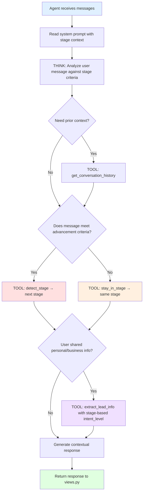
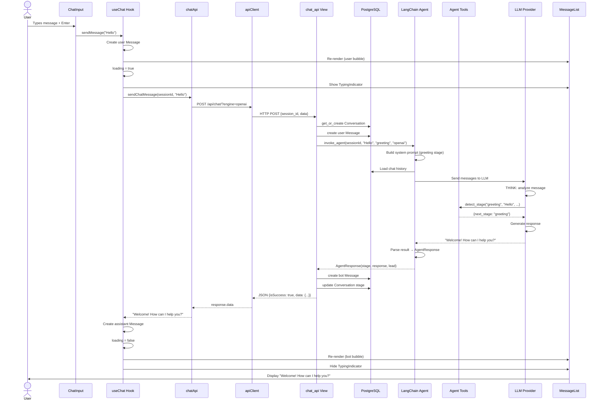
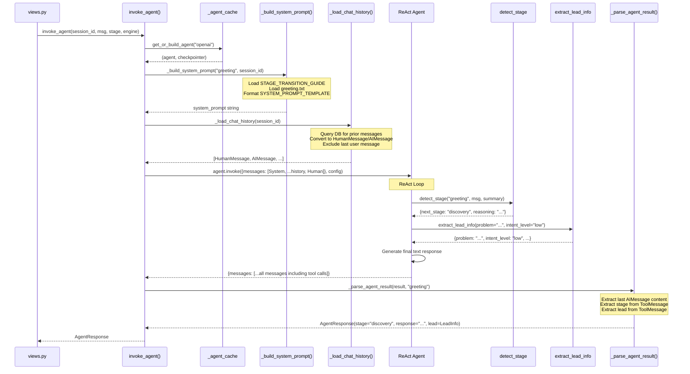
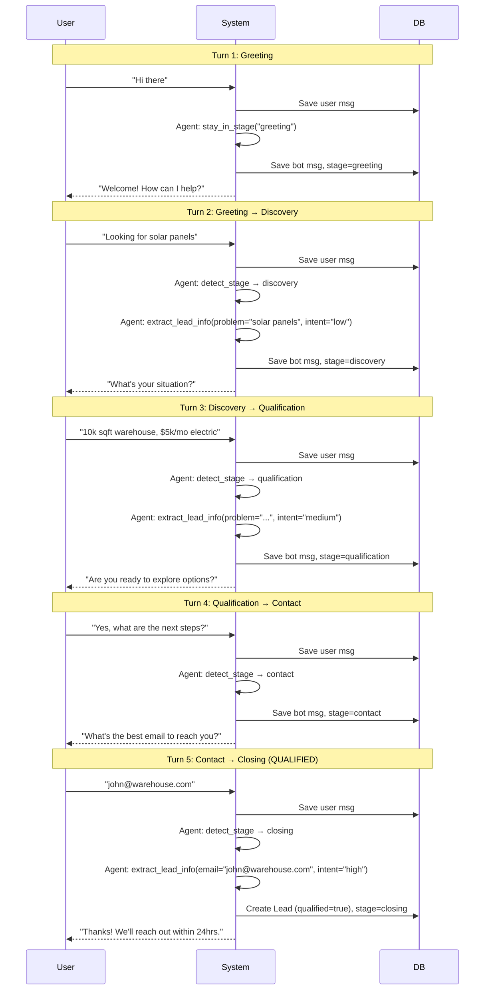

# Project Execution Flow

## Table of Contents
1. [Complete Request Lifecycle](#1-complete-request-lifecycle)
2. [Step-by-Step Execution](#2-step-by-step-execution)
3. [Agent Decision Flow](#3-agent-decision-flow)
4. [Tool Execution Paths](#4-tool-execution-paths)
5. [Stage Transition Examples](#5-stage-transition-examples)
6. [Lead Qualification Flow](#6-lead-qualification-flow)
7. [Error Handling Flow](#7-error-handling-flow)
8. [Sequence Diagrams](#8-sequence-diagrams)

---

## 1. Complete Request Lifecycle

```
User Message
     │
     ▼
┌──────────────────────┐
│   Frontend            │
│   ChatInput.tsx       │  User types "Hi, I need solar panels"
│   ↓                   │
│   useChat.ts          │  Creates user Message, calls API
│   ↓                   │
│   chatApi.ts          │  POST /api/chat/?engine=openai
│   ↓                   │
│   apiClient.ts        │  Axios HTTP request with headers
└──────────┬───────────┘
           │ HTTP POST (JSON)
           ▼
┌──────────────────────┐
│   Django Backend      │
│   urls.py             │  Route: /api/ → chat.urls → chat_api
│   ↓                   │
│   views.py            │  Parse request, get/create Conversation
│   ↓                   │  Save user Message to DB
│   langchain_agent.py  │  Build system prompt + load history
│   ↓                   │
│   ReAct Agent         │  THINK → ACT → OBSERVE → RESPOND
│   ↓                   │
│   agent_tools.py      │  detect_stage(), extract_lead_info()
│   ↓                   │
│   LLM Provider        │  OpenAI/Ollama/LMStudio generates text
│   ↓                   │
│   views.py            │  Parse result, save bot Message + Lead
└──────────┬───────────┘
           │ HTTP Response (JSON)
           ▼
┌──────────────────────┐
│   Frontend            │
│   chatApi.ts          │  Extract response string
│   ↓                   │
│   useChat.ts          │  Create assistant Message, update state
│   ↓                   │
│   MessageList.tsx     │  Render new MessageBubble
│   ↓                   │
│   ChatContainer.tsx   │  Auto-scroll to bottom
└──────────────────────┘
     │
     ▼
User Sees Response
```

---

## 2. Step-by-Step Execution

### Step 1: User Input (Frontend)

1. User types a message in the `ChatInput` textarea
2. Presses Enter (or clicks send button)
3. `ChatInput.handleSubmit()` validates non-empty input
4. Calls `onSendMessage(trimmedContent)` prop (→ `useChat.sendMessage`)

### Step 2: Frontend State Update

5. `useChat.sendMessage(content)` creates a user `Message` object:
   ```typescript
   { id: crypto.randomUUID(), role: "user", content, createdAt: new Date() }
   ```
6. Appends user message to `messages` state array
7. Sets `loading = true` (triggers `TypingIndicator` display)
8. Clears any previous error state

### Step 3: API Request

9. Calls `sendChatMessage(sessionId, content)` from `chatApi.ts`
10. Builds request payload:
    ```json
    { "session_id": "uuid-from-localStorage", "data": "user message text" }
    ```
11. `apiClient.post("/api/chat/?engine=openai", payload)` sends HTTP POST
12. Axios adds headers: `Content-Type: application/json`, `Accept: application/json`

### Step 4: Django Request Processing

13. Django URL router matches `/api/chat/` → `chat_api` view
14. `@csrf_exempt` bypasses CSRF (API endpoint)
15. `@require_http_methods(["POST"])` ensures POST only
16. `@transaction.atomic` wraps everything in a DB transaction

### Step 5: Request Parsing (views.py)

17. `json.loads(request.body)` parses JSON body
18. Extracts `session_id` and `data` (user message)
19. Gets `engine` from query parameter (default: "ollama")
20. Validates both fields are present (returns 400 if not)

### Step 6: Conversation Management

21. `Conversation.objects.get_or_create(session_id=session_id)` creates or retrieves conversation
22. New conversations start with `stage="greeting"`, `channel="website"`
23. `Message.objects.create(conversation=conversation, role="user", content=user_message)` saves user message

> **Why save BEFORE agent invocation?** The agent's `get_conversation_history` tool reads from the DB. The current message must be saved so the agent can see it if it calls that tool.

### Step 7: Agent Invocation (langchain_agent.py)

24. `invoke_agent(session_id, user_message, current_stage, engine)` is called
25. `get_or_build_agent(engine)` retrieves cached agent or builds new one:
    - `get_llm(engine)` creates `ChatOpenAI` or `ChatOllama` instance
    - `create_react_agent(model=llm, tools=[...], checkpointer=MemorySaver())` builds agent
26. `_build_system_prompt(stage, session_id)` assembles dynamic system prompt:
    - Template with stage description, advancement criteria
    - Stage-specific prompt from `utils/Prompts/Lead/<stage>.txt`
    - Tool usage instructions with intent_level mapping
27. `_load_chat_history(session_id)` loads prior messages from DB as LangChain message objects
    - Excludes the LAST user message (passed separately to avoid duplication)

### Step 8: LangChain ReAct Agent Execution

28. Agent receives `[SystemMessage, ...history, HumanMessage]` with `config={"thread_id": session_id}`
29. **THINK**: Agent reads system prompt, understands current stage and criteria
30. **ACT**: Agent decides which tools to call:

    a. **Stage evaluation** (always):
    - If criteria met → calls `detect_stage(current_stage, user_message, summary)` → returns `{next_stage: "discovery"}`
    - If criteria NOT met → calls `stay_in_stage(current_stage, reason)` → returns `{next_stage: "greeting"}`

    b. **Lead extraction** (if user shared info):
    - Calls `extract_lead_info(name="John", email=None, intent_level="low")` → returns lead data dict

    c. **History retrieval** (if needed):
    - Calls `get_conversation_history(session_id)` → returns formatted transcript

31. **OBSERVE**: Agent reads tool results
32. **RESPOND**: Agent generates final text response to the user

### Step 9: Result Parsing

33. `_parse_agent_result(result, fallback_stage)` extracts from the agent's message list:
    - **Final response**: Last `AIMessage` with content and no tool calls
    - **Stage decision**: From `detect_stage`/`stay_in_stage` `ToolMessage` content
    - **Lead info**: From `extract_lead_info` `ToolMessage` content (progressive merge)
34. Returns `AgentResponse(stage, response, lead)` Pydantic model

### Step 10: Database Persistence (views.py)

35. `Message.objects.create(role="bot", content=bot_response)` saves bot response
36. If lead has email or phone:
    - `Lead.objects.get_or_create(email=email)` creates/updates lead
    - Updates lead fields: name, company, problem, intent_level, qualified
    - Associates lead with conversation
37. `conversation.stage = next_stage; conversation.save()` updates stage

### Step 11: HTTP Response

38. Returns `JsonResponse` with:
    ```json
    {
      "isSuccess": true,
      "data": {
        "engine": "openai",
        "stage": "discovery",
        "duration": 2.45,
        "response": "Bot reply text",
        "lead": { "qualified": false, "intent_level": "low", "email": null, "phone": null }
      },
      "error": null
    }
    ```

### Step 12: Frontend Response Processing

39. `chatApi.sendChatMessage` checks `response.isSuccess` and extracts `data.response`
40. `useChat.sendMessage` creates assistant `Message` object and appends to state
41. `loading` set to `false` (hides `TypingIndicator`)
42. React re-renders `MessageList` with new `MessageBubble`
43. `ChatContainer` auto-scrolls to bottom via `useEffect` + `scrollRef`

---

## 3. Agent Decision Flow



---

## 4. Tool Execution Paths

### Path A: Stage Advancement

```
Agent analyzes: User said "I need help with solar panels for my warehouse"
Current stage: greeting
Criteria: "Visitor has responded and indicated why they're here" ✓

→ Agent calls: detect_stage(
    current_stage="greeting",
    user_message="I need help with solar panels for my warehouse",
    conversation_summary="Visitor has indicated they need solar panels for a warehouse"
  )

→ Tool returns: {
    current_stage: "greeting",
    next_stage: "discovery",
    reasoning: "Advanced from greeting to discovery. Criteria: visitor indicated purpose"
  }

→ Agent also calls: extract_lead_info(
    problem="needs solar panels for warehouse",
    intent_level="low"  ← greeting/discovery = low
  )
```

### Path B: Stay in Stage

```
Agent analyzes: User said "hmm, not sure yet"
Current stage: discovery
Criteria: "Visitor has clearly described their problem" ✗

→ Agent calls: stay_in_stage(
    current_stage="discovery",
    reason="Visitor hasn't described their specific problem yet"
  )

→ Tool returns: {
    current_stage: "discovery",
    next_stage: "discovery",
    reasoning: "Staying in discovery: Visitor hasn't described their specific problem yet"
  }
```

### Path C: Lead Extraction with High Intent

```
Agent analyzes: User said "Sure, my email is john@company.com"
Current stage: contact
Criteria: "Visitor has provided email or phone" ✓

→ Agent calls: detect_stage(
    current_stage="contact",
    user_message="Sure, my email is john@company.com",
    conversation_summary="Visitor provided email address"
  )

→ Agent calls: extract_lead_info(
    email="john@company.com",
    intent_level="high"  ← contact/closing = high
  )

→ Lead qualification: intent_level="high" + email provided = QUALIFIED ✓
```

### Path D: History Retrieval

```
Agent needs context about earlier discussion.

→ Agent calls: get_conversation_history(session_id="abc-123")

→ Tool returns:
  "User: Hi there
   Assistant: Welcome! How can I help you today?
   User: I'm looking for solar panel installation
   Assistant: Great! Can you tell me more about your situation?
   User: We have a 10,000 sq ft warehouse"
```

---

## 5. Stage Transition Examples

### Full Conversation Flow

```
Turn 1: GREETING → DISCOVERY
  User: "Hi, I'm interested in your solar solutions"
  Agent: detect_stage → advance to discovery
  Agent: extract_lead_info(intent_level="low")
  Bot: "Thanks for your interest! What specific needs do you have?"

Turn 2: DISCOVERY (stay)
  User: "We have a large warehouse"
  Agent: stay_in_stage → need more detail
  Agent: extract_lead_info(problem="large warehouse", intent_level="low")
  Bot: "That sounds like a great opportunity. How much roof space are we talking about?"

Turn 3: DISCOVERY → QUALIFICATION
  User: "About 10,000 sq ft, we want to reduce our $5k monthly energy bill"
  Agent: detect_stage → advance to qualification
  Agent: extract_lead_info(problem="10k sqft warehouse, $5k/mo energy", intent_level="medium")
  Bot: "With that roof space, you could see significant savings. Are you looking to start soon?"

Turn 4: QUALIFICATION → CONTACT
  User: "Yes, we want to start this quarter. What are the next steps?"
  Agent: detect_stage → advance to contact
  Bot: "Excellent! I'd love to have our team put together a proposal. What's the best email?"

Turn 5: CONTACT → CLOSING
  User: "Sure, it's john@warehouse.com"
  Agent: detect_stage → advance to closing
  Agent: extract_lead_info(email="john@warehouse.com", intent_level="high")
  → QUALIFIED: intent_level=high + email provided ✓
  Bot: "Thank you, John! Our team will reach out within 24 hours with a custom proposal."
```

---

## 6. Lead Qualification Flow

```mermaid
flowchart TD
    Start[User shares info] --> ExtractTool[extract_lead_info tool called]

    ExtractTool --> StageCheck{Current stage?}
    StageCheck -->|greeting/discovery| Low[intent_level = "low"]
    StageCheck -->|qualification| Medium[intent_level = "medium"]
    StageCheck -->|contact/closing| High[intent_level = "high"]

    Low --> HasContact{Has email or phone?}
    Medium --> HasContact
    High --> HasContact

    HasContact -->|No| NotQualified[qualified = false]
    HasContact -->|Yes| IntentCheck{intent_level == "high"?}

    IntentCheck -->|No| NotQualified
    IntentCheck -->|Yes| Qualified[qualified = true ✓]

    Qualified --> SaveLead[Save/update Lead in DB]
    NotQualified --> SaveLead

    SaveLead --> UpdateConv[Associate Lead with Conversation]

    style Qualified fill:#90EE90
    style NotQualified fill:#FFB6C1
```

### Qualification Business Rule
```python
qualified = (intent_level == "high") AND (email OR phone provided)
```

| Scenario | Intent | Contact Info | Result |
|----------|--------|-------------|--------|
| User in greeting says name | low | No | Not qualified |
| User in qualification asks about pricing | medium | No | Not qualified |
| User in contact provides email | high | Yes (email) | **QUALIFIED** |
| User in closing provides phone | high | Yes (phone) | **QUALIFIED** |
| User in discovery provides email | low | Yes (email) | Not qualified (intent too low) |

---

## 7. Error Handling Flow

### Frontend Error Chain

```
API Call Fails
     │
     ├── Network Error (no response)
     │    └── apiClient.ts: "Network error — unable to reach server"
     │
     ├── Timeout (15s exceeded)
     │    └── apiClient.ts: "Request timed out"
     │
     ├── Server Error (500)
     │    └── apiClient.ts: extract "detail" or generic message
     │
     └── API Error (isSuccess=false)
          └── chatApi.ts: throw Error(response.error)

All errors → useChat.sendMessage catch block
     └── Create assistant Message with error text
     └── Append to messages (displayed as bot bubble)
     └── Set error state
```

### Backend Error Chain

```
Request arrives at chat_api()
     │
     ├── JSON parse error
     │    └── Return 400: "Invalid JSON in request body"
     │
     ├── Missing session_id
     │    └── Return 400: "session_id is required"
     │
     ├── Missing data
     │    └── Return 400: "Message is required"
     │
     ├── ValueError (bad engine, missing API key)
     │    └── Return 400: error message
     │
     ├── Agent execution error
     │    └── Return 500: "Internal LLM error"
     │
     └── Lead save error (ValidationError)
          └── Logged, not returned (conversation still succeeds)
```

---

## 8. Sequence Diagrams

### Complete End-to-End Sequence



### Agent Internal Execution Sequence



### Multi-Turn Conversation Flow


