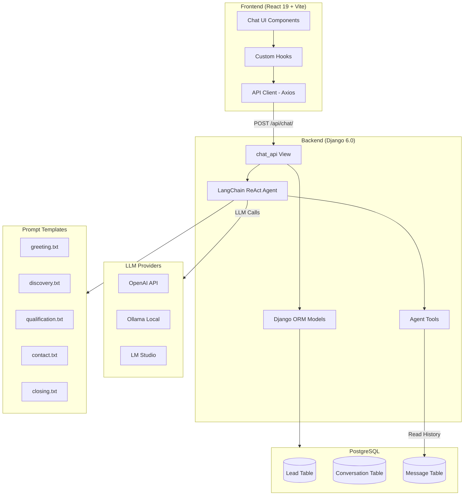
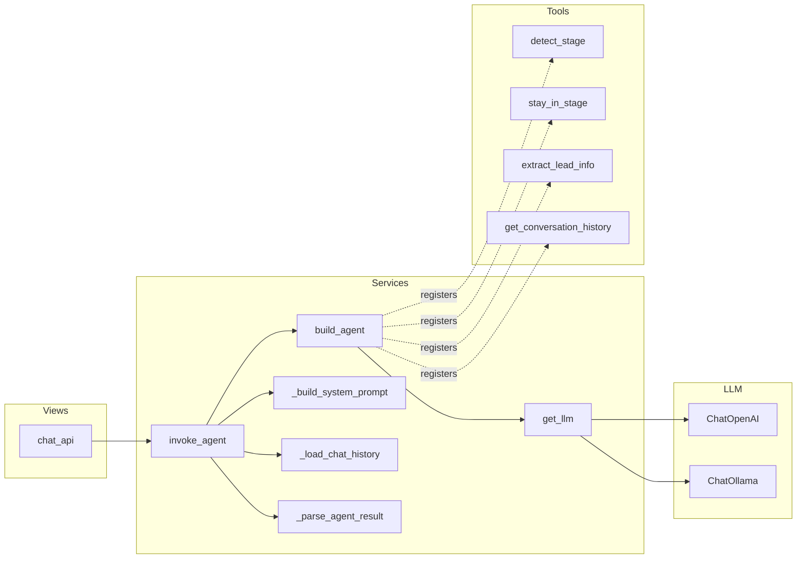
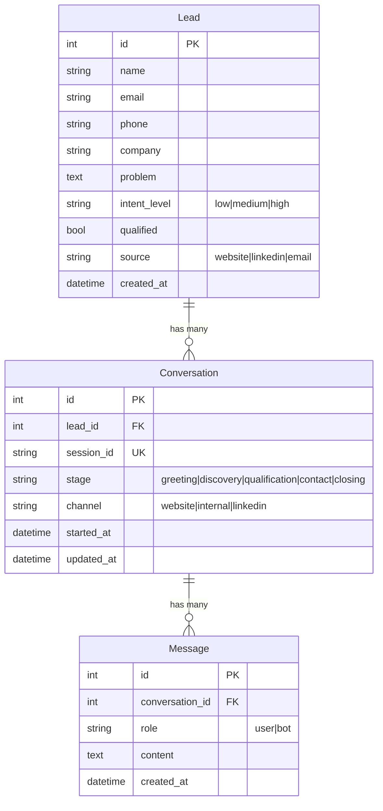

# System Architecture Documentation

## Table of Contents
1. [System Overview](#system-overview)
2. [Project Structure Map](#project-structure-map)
3. [High-Level Architecture](#high-level-architecture)
4. [Backend Architecture](#backend-architecture)
5. [Frontend Architecture](#frontend-architecture)
6. [AI Orchestration Layer](#ai-orchestration-layer)
7. [Database Design](#database-design)
8. [External Service Integrations](#external-service-integrations)
9. [Configuration & Environment](#configuration--environment)
10. [Dependencies](#dependencies)

---

## 1. System Overview

This project is a **full-stack AI-powered lead generation chatbot** built for business websites. It guides website visitors through a structured sales funnel (greeting → discovery → qualification → contact → closing) using a LangChain ReAct agent with tool-calling capabilities.

### Key Characteristics
- **Backend**: Django 6.0 (Python) with Django REST Framework
- **Frontend**: React 19 + TypeScript + Vite + Tailwind CSS
- **AI Engine**: LangChain ReAct Agent with LangGraph orchestration
- **Database**: PostgreSQL
- **LLM Support**: OpenAI, Ollama (local), LM Studio (local)
- **Communication**: REST API with JSON payloads

---

## 2. Project Structure Map

```
ChatBot/
│
├── chatbot_backend/                    # Django backend application
│   ├── manage.py                       # Django management entry point
│   │
│   ├── chatbot_backend/               # Django project settings package
│   │   ├── __init__.py
│   │   ├── settings.py                # Central configuration (DB, CORS, LLM, logging)
│   │   ├── urls.py                    # Root URL router → includes chat.urls
│   │   ├── asgi.py                    # ASGI entry point
│   │   └── wsgi.py                    # WSGI entry point
│   │
│   ├── chat/                          # Main Django app — all chatbot logic
│   │   ├── __init__.py
│   │   ├── admin.py                   # Django admin (empty — not configured)
│   │   ├── apps.py                    # App config: name='chat'
│   │   ├── models.py                  # Lead, Conversation, Message models
│   │   ├── urls.py                    # URL: /api/chat/ → chat_api view
│   │   ├── views.py                   # Single API endpoint: chat_api()
│   │   ├── tests.py                   # Test placeholder (empty)
│   │   ├── utils.py                   # LLM generation helpers (Ollama, OpenAI, LMStudio)
│   │   │
│   │   └── services/                  # Business logic layer
│   │       ├── langchain_agent.py     # ★ CORE: LangChain ReAct agent (invoke_agent)
│   │       ├── agent_tools.py         # LangChain tools: detect_stage, extract_lead_info, etc.
│   │       ├── schemas.py             # Pydantic schemas: AgentResponse, LeadInfo, StageDecision
│   │       ├── lead_models.py         # Legacy LeadData dataclass
│   │       ├── lead_extraction.py     # Legacy LLM-based lead extraction (replaced by agent)
│   │       ├── conversation_orchestrator.py  # Legacy keyword-based stage logic (replaced)
│   │       ├── ai_service.py          # Alternative Ollama HTTP client (legacy)
│   │       └── langgraph_state.py     # ConversationState dataclass for LangGraph
│   │
│   └── utils/                         # Shared utilities
│       ├── message.py                 # Error/success/info message constants
│       └── Prompts/                   # Prompt template files
│           ├── Lead/                  # Stage-specific prompts
│           │   ├── greeting.txt       # Welcome & intent discovery
│           │   ├── discovery.txt      # Problem understanding
│           │   ├── qualification.txt  # Customer assessment
│           │   ├── contact.txt        # Contact info collection
│           │   └── closing.txt        # Conversation wrap-up
│           ├── Chat/
│           │   └── generic.txt        # Generic chat fallback prompt
│           └── Extract/
│               └── lead_extract.txt   # Lead data extraction prompt
│
├── chatbot-frontend/                  # React frontend application
│   ├── index.html                     # HTML entry point
│   ├── package.json                   # Dependencies: React 19, Axios, Tailwind
│   ├── vite.config.ts                 # Vite build configuration
│   ├── tailwind.config.ts             # Tailwind CSS configuration
│   ├── tsconfig.json                  # TypeScript configuration
│   │
│   └── src/
│       ├── main.tsx                   # React root: renders <App />
│       ├── App.tsx                    # Renders <AppLayout />
│       ├── index.css                  # Global styles + Tailwind imports
│       │
│       ├── config/
│       │   └── env.ts                 # Environment config (VITE_API_BASE_URL)
│       │
│       ├── types/
│       │   └── chat.ts               # TypeScript interfaces: Message, ChatSession, API types
│       │
│       ├── services/
│       │   ├── apiClient.ts           # Axios instance with error interceptor
│       │   └── chatApi.ts             # sendChatMessage() — API call wrapper
│       │
│       ├── hooks/
│       │   ├── useChat.ts            # Chat state: messages, loading, sendMessage
│       │   ├── useChatSession.ts     # Session ID management (localStorage)
│       │   └── useTheme.ts           # Dark/light theme toggle
│       │
│       ├── layouts/
│       │   └── AppLayout.tsx          # Main layout: Sidebar + ChatContainer
│       │
│       ├── pages/
│       │   └── HomePage.tsx           # Placeholder page (unused)
│       │
│       └── components/
│           ├── chat/
│           │   ├── ChatContainer.tsx  # Scrollable chat area + input
│           │   ├── ChatInput.tsx      # Text input with send button
│           │   ├── MessageBubble.tsx  # Individual message rendering
│           │   ├── MessageList.tsx    # Message list with empty state
│           │   └── TypingIndicator.tsx # Animated typing dots
│           │
│           ├── sidebar/
│           │   ├── Sidebar.tsx        # Session list + theme toggle
│           │   ├── SidebarItem.tsx    # Individual session entry
│           │   └── NewChatButton.tsx  # Create new chat session
│           │
│           └── common/
│               └── ThemeToggle.tsx    # Sun/moon theme switch
│
├── requirements.txt                   # Python dependencies
├── readme.md                          # Project readme
├── CLAUDE.md                          # AI assistant reference guide
└── .gitignore                         # Git ignore rules
```

### Folder Responsibilities

| Folder | Responsibility |
|--------|---------------|
| `chatbot_backend/chatbot_backend/` | Django project config: settings, URL routing, WSGI/ASGI |
| `chatbot_backend/chat/` | Core chatbot app: API endpoint, models, business logic |
| `chatbot_backend/chat/services/` | AI orchestration: LangChain agent, tools, schemas |
| `chatbot_backend/utils/` | Shared utilities: message constants, prompt templates |
| `chatbot_backend/utils/Prompts/` | Stage-specific prompt text files loaded at runtime |
| `chatbot-frontend/src/components/` | React UI components: chat interface, sidebar, common |
| `chatbot-frontend/src/hooks/` | Custom React hooks: chat state, sessions, theming |
| `chatbot-frontend/src/services/` | API communication layer (Axios-based) |
| `chatbot-frontend/src/types/` | TypeScript type definitions |
| `chatbot-frontend/src/config/` | Environment variable configuration |

---

## 3. High-Level Architecture

```
┌─────────────────────────────────────────────────────────────────────┐
│                        SYSTEM ARCHITECTURE                          │
├─────────────────────────────────────────────────────────────────────┤
│                                                                     │
│  ┌──────────────────────┐         ┌──────────────────────────────┐ │
│  │   FRONTEND (React)   │  HTTP   │      BACKEND (Django)        │ │
│  │                      │────────>│                              │ │
│  │  Vite + TypeScript   │  JSON   │  Django 6.0 + DRF           │ │
│  │  Tailwind CSS        │<────────│                              │ │
│  │  Axios HTTP Client   │         │  ┌────────────────────────┐  │ │
│  │                      │         │  │   LangChain Agent      │  │ │
│  │  Port: 5174          │         │  │   (ReAct + LangGraph)  │  │ │
│  └──────────────────────┘         │  │                        │  │ │
│                                   │  │  ┌──────────────────┐  │  │ │
│                                   │  │  │  Tools:          │  │  │ │
│                                   │  │  │  - detect_stage  │  │  │ │
│                                   │  │  │  - stay_in_stage │  │  │ │
│                                   │  │  │  - extract_lead  │  │  │ │
│                                   │  │  │  - get_history   │  │  │ │
│                                   │  │  └──────────────────┘  │  │ │
│                                   │  └────────────────────────┘  │ │
│                                   │              │               │ │
│                                   │              ▼               │ │
│  ┌──────────────────────┐         │  ┌────────────────────────┐  │ │
│  │   LLM PROVIDERS      │<────────│  │   PostgreSQL           │  │ │
│  │                      │         │  │   - Lead               │  │ │
│  │  - OpenAI API        │         │  │   - Conversation       │  │ │
│  │  - Ollama (local)    │         │  │   - Message            │  │ │
│  │  - LM Studio (local) │         │  └────────────────────────┘  │ │
│  └──────────────────────┘         └──────────────────────────────┘ │
│                                                                     │
└─────────────────────────────────────────────────────────────────────┘
```

### Architecture Diagram (Mermaid)



---

## 4. Backend Architecture

### Layer Diagram

```
┌─────────────────────────────────────────────────────┐
│                  HTTP Layer                           │
│  chat/urls.py → path("chat/", chat_api)             │
│  chatbot_backend/urls.py → path("api/", include())  │
├─────────────────────────────────────────────────────┤
│                  View Layer                           │
│  chat/views.py → chat_api()                          │
│  - Parse request (session_id, data, engine)          │
│  - Get/create Conversation                           │
│  - Save user Message                                 │
│  - Call invoke_agent()                               │
│  - Save bot Message + Lead                           │
│  - Return JSON response                              │
├─────────────────────────────────────────────────────┤
│                  Agent Layer                          │
│  services/langchain_agent.py → invoke_agent()        │
│  - Build system prompt (stage-specific)              │
│  - Load conversation history from DB                 │
│  - Invoke LangGraph ReAct agent                      │
│  - Parse agent result → AgentResponse                │
├─────────────────────────────────────────────────────┤
│                  Tools Layer                          │
│  services/agent_tools.py                             │
│  - detect_stage() — advance funnel stage             │
│  - stay_in_stage() — remain in current stage         │
│  - extract_lead_info() — capture lead data           │
│  - get_conversation_history() — load from DB         │
├─────────────────────────────────────────────────────┤
│                  Schema Layer                         │
│  services/schemas.py                                 │
│  - AgentResponse (stage + response + lead)           │
│  - LeadInfo (name, email, phone, company, etc.)      │
│  - StageDecision (current_stage → next_stage)        │
├─────────────────────────────────────────────────────┤
│                  Model Layer                          │
│  chat/models.py                                      │
│  - Lead (name, email, phone, qualified, intent)      │
│  - Conversation (session_id, stage, lead FK)         │
│  - Message (conversation FK, role, content)          │
├─────────────────────────────────────────────────────┤
│                  Data Layer                           │
│  PostgreSQL Database                                 │
└─────────────────────────────────────────────────────┘
```

### Service Interaction Diagram



---

## 5. Frontend Architecture

### Component Tree

```
<App>
  └── <AppLayout>
       ├── <Sidebar>
       │    ├── <ThemeToggle />
       │    ├── <NewChatButton />
       │    └── <SidebarItem /> (×N sessions)
       │
       └── <ChatContainer>
            ├── <MessageList>
            │    └── <MessageBubble /> (×N messages)
            ├── <TypingIndicator /> (conditional)
            └── <ChatInput />
```

### Frontend Data Flow

```
┌──────────────────────────────────────────────────┐
│  AppLayout (orchestrates everything)              │
│  ├── useTheme() → theme state + toggle            │
│  ├── useChatSession() → sessionId + reset         │
│  └── useChat(sessionId) → messages, loading, send │
│                                                    │
│  User types message → ChatInput.onSend()           │
│       ↓                                            │
│  useChat.sendMessage(content)                      │
│       ↓                                            │
│  chatApi.sendChatMessage(sessionId, content)       │
│       ↓                                            │
│  apiClient.post("/api/chat/?engine=openai", body)  │
│       ↓                                            │
│  Django Backend processes → returns JSON            │
│       ↓                                            │
│  response.data.response → assistant Message        │
│       ↓                                            │
│  setMessages([...prev, assistantMessage])           │
│       ↓                                            │
│  MessageList re-renders with new MessageBubble      │
└──────────────────────────────────────────────────┘
```

---

## 6. AI Orchestration Layer

The AI layer uses a **LangChain ReAct Agent** orchestrated by **LangGraph**:

```
┌─────────────────────────────────────────────────┐
│              LangChain ReAct Agent               │
│                                                  │
│  1. THINK: Read system prompt + conversation     │
│  2. ACT:   Call detect_stage or stay_in_stage    │
│  3. OBSERVE: Read tool result                    │
│  4. ACT:   Call extract_lead_info (if needed)    │
│  5. OBSERVE: Read tool result                    │
│  6. RESPOND: Generate final text reply           │
└─────────────────────────────────────────────────┘
```

### Agent Singleton Pattern
- Agents are cached per engine in `_agent_cache` (module-level dict)
- `MemorySaver` checkpointer persists agent state across requests
- `thread_id = session_id` links invocations to conversation checkpoints

---

## 7. Database Design



---

## 8. External Service Integrations

| Service | Purpose | Configuration |
|---------|---------|---------------|
| **OpenAI API** | Primary cloud LLM (GPT-4o) | `OPENAI_API_KEY`, `LLM_MODEL_OPEN_AI` |
| **Ollama** | Local LLM inference | `OLLAMA_URL`, `LLM_MODEL_NAME`, `REMOTE_SERVER_IP_OLLAMA` |
| **LM Studio** | Local LLM (OpenAI-compatible) | `LLM_LOCAL_API_BASE`, `LLM_MODEL_NAME` |
| **PostgreSQL** | Relational database | `POSTGRES_DB`, `POSTGRES_USER`, `POSTGRES_PASSWORD`, etc. |

---

## 9. Configuration & Environment

### Backend Environment Variables (.env)

| Variable | Default | Purpose |
|----------|---------|---------|
| `POSTGRES_DB` | chatbot_db | Database name |
| `POSTGRES_USER` | postgres | Database user |
| `POSTGRES_PASSWORD` | (empty) | Database password |
| `POSTGRES_HOST` | localhost | Database host |
| `POSTGRES_PORT` | 5432 | Database port |
| `OLLAMA_URL` | http://localhost:11434/api/generate | Ollama API endpoint |
| `LLM_MODEL_NAME` | phi3:mini | Default Ollama model |
| `LLM_MODEL_OPEN_AI` | gpt-4o | OpenAI model name |
| `OPENAI_API_KEY` | (empty) | OpenAI authentication |
| `LLM_LOCAL_API_BASE` | http://localhost:11434 | Local LLM base URL |
| `REMOTE_SERVER_IP_OLLAMA` | (empty) | Remote Ollama server |

### Frontend Environment Variables (.env.development)

| Variable | Purpose |
|----------|---------|
| `VITE_API_BASE_URL` | Backend API base URL (e.g., http://localhost:8000) |

### CORS Configuration
- Allowed origins: `http://localhost:5174` (Vite dev server)
- Credentials allowed: Yes
- CSRF trusted origins: `http://localhost:5174`

---

## 10. Dependencies

### Backend (Python)

| Package | Version | Purpose |
|---------|---------|---------|
| Django | 6.0 | Web framework |
| djangorestframework | 3.16.1 | REST API framework |
| psycopg2-binary | ≥2.9.10 | PostgreSQL driver |
| langchain | ≥0.3.0 | AI agent framework |
| langchain-core | ≥0.3.0 | LangChain core abstractions |
| langchain-openai | ≥0.3.0 | OpenAI LLM integration |
| langchain-ollama | ≥0.3.0 | Ollama LLM integration |
| langgraph | ≥0.3.0 | Agent orchestration |
| openai | ≥1.102.0 | OpenAI Python SDK |
| ollama | ≥0.5.3 | Ollama Python SDK |
| python-dotenv | 1.2.1 | .env file loading |
| requests | 2.32.5 | HTTP client |
| httpx | ≥0.28.1 | Async HTTP client |

### Frontend (Node.js)

| Package | Version | Purpose |
|---------|---------|---------|
| react | 19.2.0 | UI library |
| react-dom | 19.2.0 | DOM rendering |
| react-router-dom | 7.13.0 | Client-side routing |
| axios | 1.13.5 | HTTP client |
| tailwindcss | 3.4.19 | Utility CSS framework |
| typescript | 5.9.3 | Type safety |
| vite | 7.2.4 | Build tool + dev server |
