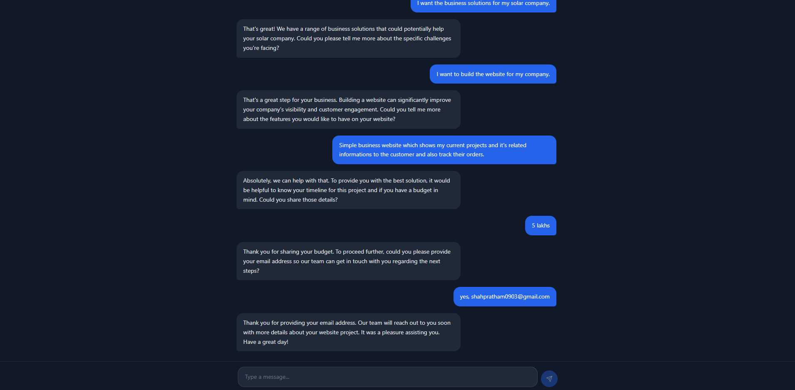

# AI Chatbot Assistant (Django + React)

A full-stack AI chatbot application built with **Django (REST API)** and **React (Vite + TypeScript)**.
The backend handles AI requests securely, while the frontend provides a modern chat UI suitable for website integration.

---

## 📸 Demo



---

## 📌 Tech Stack

### Backend

- Python
- Django
- Django REST Framework
- Virtual Environment (venv)

### Frontend

- React
- Vite
- TypeScript
- npm

### AI Integration

- Ollama (Local LLM – free)
- Easily extendable to OpenAI / Gemini / Grok / other providers

---

## ⚙️ Backend Setup (Django)

### 1️⃣ Clone the repository
- (Using https)

```bash
git clone https://github.com/Pratham10036/ChatBot.git
cd ChatBot
```
- (Using SSH)

```bash
git clone git@github.com:Pratham10036/ChatBot.git
cd ChatBot
```

### 2️⃣ Create a virtual environment

```bash
python -m venv venv
```

### 3️⃣ Activate the virtual environment
- Windows

```bash
venv\Scripts\activate
```
- Linux / macOS

```bash
source venv/bin/activate
```


### 4️⃣ Install backend dependencies

```bash
pip install -r requirements.txt
```

### 5️⃣ Run the Django development server

```bash
python manage.py runserver
```

#### Backend will be available at: http://localhost:8000


---

# ⚛️ Frontend Setup (React + Vite + TypeScript)

### 1️⃣ Navigate to frontend directory

```bash
cd chatbot-frontend
```

### 2️⃣ Install frontend dependencies

```bash
npm install
```

### 3️⃣ Start the Vite development server
```bash
npm run dev
```

#### Frontend will be available at: http://localhost:5173

---

# 🤖 AI Setup (Ollama – Free Local LLM)

### 1️⃣ Install Ollama
#### Download from: https://ollama.com

### 2️⃣ Pull an AI model
- High capacity model
```bash
ollama pull llama3
```
- Low capacity model
```bash
ollama pull phi3:mini
```

### 3️⃣ Run the model
```bash
ollama run llama3
```
or
```bash
ollama run phi3:mini
```

#### Ollama runs locally and exposes an API at: http://localhost:11434
The Django backend communicates with Ollama through this endpoint.

## 🔐 Environment Variables (`.env`)

This project uses environment variables to manage **AI providers, prompt paths, and configuration securely**.

⚠️ **Do NOT commit this file to GitHub**

---

### 📁 Where to Create the `.env` File

Create the `.env` file inside the **`chatbot_backend/`** directory:

```text
ChatBot/
├── chatbot_backend/
│   ├── chatbot_backend/
│   ├── chat/
│   ├── manage.py
│   ├── .env   ← CREATE HERE
├── chatbot-frontend/
└── README.md
```


#### 🧠 AI / LLM Configuration (Example)
```text
# ===============================
# Django Settings
# ===============================
DEBUG=True

# ===============================
# AI / LLM Configuration
# ===============================

# Ollama local API endpoint
OLLAMA_URL=http://localhost:11434/api/generate

# Default local model
LLM_MODEL_NAME=your_model_name (recommendation: phi3:mini)

# Base URLs for LLM APIs
LLM_LOCAL_API_BASE=http://localhost:11434
LLM_API_BASE_URL=http://localhost:11434

# OpenAI (optional)
LLM_MODEL_OPEN_AI=gpt-4
OPENAI_API_KEY=your-openai-api-key-here

# Prompt templates directory
PROMPTS_DIR=utils/Prompts

# ===============================
# Database Configuration
# ===============================

POSTGRES_DB=your_database_name
POSTGRES_USER=your_database_user
POSTGRES_PASSWORD=your_database_password
POSTGRES_HOST=localhost
POSTGRES_PORT=5432
```


## 🚀 How to Run the Project
- Start Ollama
- Activate Python virtual environment

- Run Django backend server

- Run React frontend server

- Open the frontend URL in browser

- Start chatting with the AI assistant


## 🧠 Features

- REST-based chatbot API

- Secure backend architecture

- Local AI model (no API cost)

- Modern frontend with React + TypeScript

- Easy to deploy and scale

- Resume-ready real-world project
